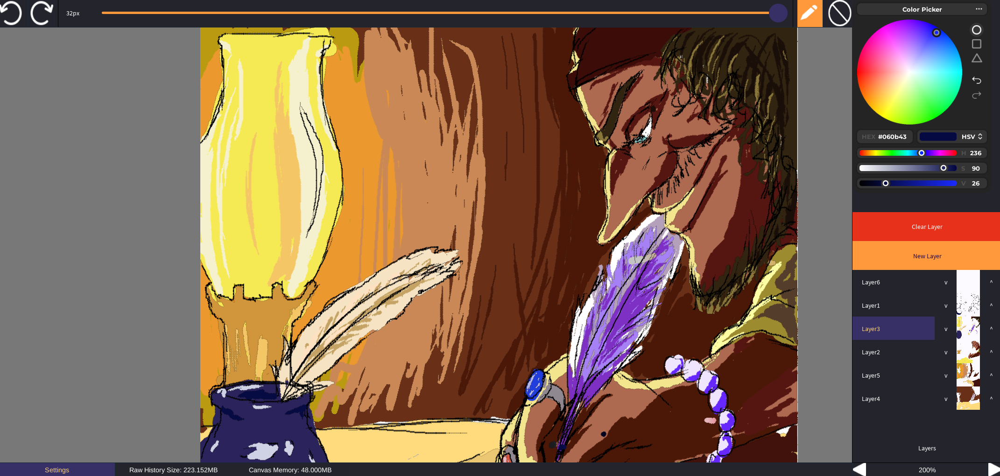
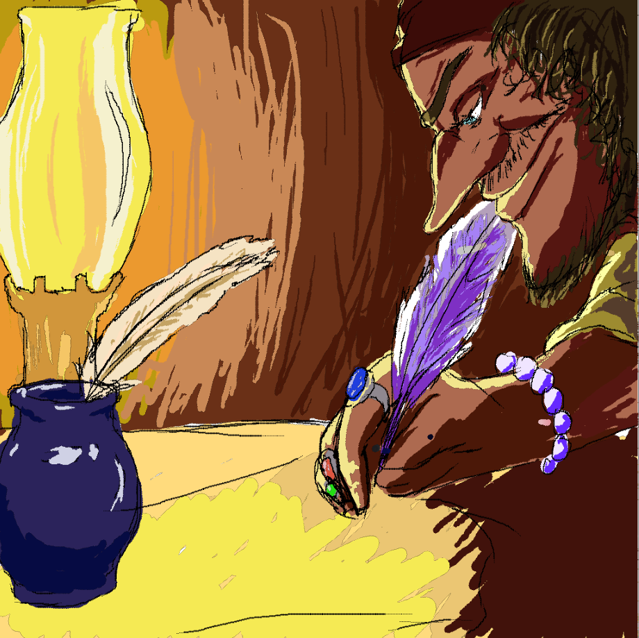

# RBX Pen Showcase

This small project showcases a potential method of consuming pen tablet pressure data in Roblox
via emulating controller input, mapping pen pressure to gamepad trigger actuation.

Theoretically if you're not dumb like me you can make a proper pressure reader and virtual gamepad yourself,
but I am dumb, so this showcase requires [OpenTabletDriver](https://opentabletdriver.net/) and [ViGEmBus Driver](https://github.com/nefarius/ViGEmBus) to function.
The pressure mapper itself is implemented as an OpenTabletDriver plugin with a ViGEmBus client
to control the virtual gamepad by software.

> [!NOTE]
> Although the [VMulti Driver](https://github.com/X9VoiD/vmulti-bin/releases/latest)
> is not required for the demo to function properly
> since it is read via controller input instead of Windows Ink,
> you will still want it for pen pressure in other applications if you plan on
> switching to OpenTabletDriver permanently.

If you guys are aware of any simpler (or interesting!) ways of forwarding pen pressure, let me know!
I'd love to hear about it and perhaps add support for the method to the painting program.
One alternative approach that my brain has cooked up is creating a virtual
microphone that could be used in a similar fashion.

Additional note, the approach showcased here should theoretically
be usable on other platforms since OpenTabletDriver is cross-platform, however:

1) For Linux, I need to get around to writing a simple uinput/evdev wrapper in C# to make a virtual controller
2) I don't have a MacOS device to test on lol
3) I can't even remotely imagine how you would do this on mobile

If you'd like to add implementations for other platforms yourself,
please feel free to open a pull request!

<details>
<summary>Setup (Windows-Only For Now)</summary>

If you plan on working on this project yourself, the following steps are needed to enable pen pressure mapping.

1) Install [OpenTabletDriver](https://opentabletdriver.net/). Note that this requires you **uninstall** any other drawing tablet drivers you currently have installed.
Additionally check their [compatibility list](https://opentabletdriver.net/Tablets) to see if your drawing tablet is actually supported.

> Note - Although the [VMulti Driver](https://github.com/X9VoiD/vmulti-bin/releases/latest) is not required for the demo to function properly since it is read via controller input instead of Windows Ink,
> you will still want it for pen pressure in other applications if you plan on switching to OpenTabletDriver permanently.

2) Install [ViGemBus driver](https://github.com/nefarius/ViGEmBus/releases). Yes, I am fully aware that the project has been archived and abandoned for 3 years,
but honestly, could not find an actual alternative that had an actual programmable API and isn't *even older*.

3) Download and add the [pressure mapper plugin](https://github.com/PhantomShift/rbx-pen-showcase/releases).
The simplest installation method is opening the plugin manager in OpenTabletDriver and dragging the zip file.

5) Enable the plugin via the `Filters` tab in OpenTabletDriver.

If everything has been installed and set up correctly, you should successfully hear one indication sound that a controller has been "connected". You can confirm that pressure is working by searching Windows for "Set up USB game controller" and checking that Z-axis shifts left when applying pressure.

</details>

## OpenTabletDriver Plugin Build Instructions

Requirements:

1) .NET SDK Version 8 (`Microsoft.DotNet.SDK.8` on winget)
2) `just` command runner

For simply validating build, run `just build-plugin`.

To package into a zip archive with DLLs included, run `just get-plugin`.

## Place Build Instructions

The demo is built using Rojo and Wally. Run `wally install` to retrieve relevant packages.
The demo additionally depends on Viperdune's [Advanced Color Picker](https://create.roblox.com/store/asset/104339729813105),
which should be added manually to the `external` directory in the filesystem or the `ReplicatedStorage.External` folder in studio.

```bash
rojo build -o showcase.rbxlx
```

> [!WARNING]
> At the time of writing, a problem with [StyleRule serialization](https://github.com/rojo-rbx/rbx-dom/issues/597)
> prevents the resultant `.rbxlx` file from being imported into Studio successfully.
> As a temporary workaround, the provided script `FixImport.luau`
> can be run to fix it (`lune run FixImport.luau showcase.rbxlx`).

Note that the current layering implementation is based solely on transparent `EditableImage`s,
and thus, due to the [32MB limit](https://devforum.roblox.com/t/editableimage-higher-resolution-and-memory-limit/4389575),
only supports a couple of layers on the player client (this is not an issue in studio).
In the future, I plan on implementing a compositor with the following layering
scheme in order to allow for an arbitrary number of layers:

```
---- = buffer object
#### = EditableImage (has an additional implicit buffer object on top of it)

------- Virtual topmost layer
------- Additional virtual layers
-------
####### Upper virtual layers composited
####### Active stroke layer (virtual layer edited during a brush stroke)
####### Active layer (layer being edited)
------- Lower virtual layers
-------
####### Lower virtual layers composited
```

Additional future plans for the paint program specifically include in no particular order:

- Additional settings and shortcuts, saving settings between sessions
- Saving, loading and sharing drawings (note: requires special consideration for upcoming [DataStore limits](https://create.roblox.com/docs/cloud-services/data-stores/error-codes-and-limits#storage-limits))
- More advanced brush engine
- Multiplayer drawing mode
- Resizing docks/windows

## License and Mentions

The code written specifically for this showcase is licensed under the
MIT License and is freely available to learn and reference from.
However, if you use any of the code directly and it has been helpful to you,
a shoutout would be appreciated (plus I want to see whatever cool stuff you make!).

A bunch of knowledge around `EditableImage`s has been derived from the
very comprehensive overview by the author of the OSGL library
that this project also makes use of, so shoutout to sawdust for being cool.

- [OSGL](https://github.com/osgl-rbx/osgl)
- [A complete guide to EditableImages](https://devforum.roblox.com/t/a-complete-guide-to-editableimages/3858566)

## Example Media

"How Roblox Must've Felt Setting the 32MB EditableImage Limit"





Short speed paint example


